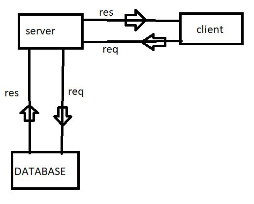

# Movies-Library
# Project Name - Task#11

**Author Name**: idrees

## WRRC
Add an image of your WRRC here

## Overview

## Getting Started
<!-- first of all we make repo and then clone it to our local machin and creat new branch then work on it -->
<!-- we start ti configure express lip and call it  -->
<!-- we call data from this website THE MOVIE DB using require -->
<!-- i use constructore to format the data  -->
<!-- we make two functions one for trending and another for search -->
<!-- Create a route with a method of get and a path of /trndingfor trendng page and /search for search page -->
<!-- in this task i add 3 more endpoint one of it for get specific id and the second one for delete data and the third one to update data -->

## Project Features
<!-- my app show moves name and moves poster and overview for each move -->
<!-- using my app you can see the trending movies and you can search for any movieyou want -->
<!-- you can get data from saved data and you can update it and you can delete any saved data  -->